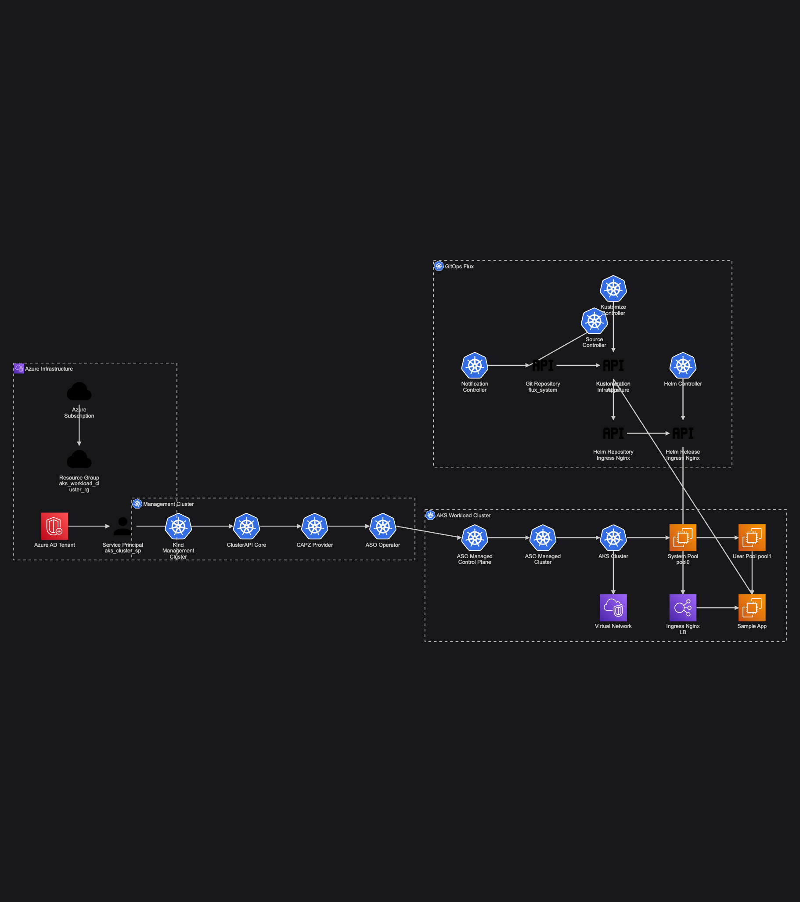

# Azure AKS with ClusterAPI and FluxCD

A comprehensive Infrastructure as Code solution for Azure Kubernetes Service (AKS) using ClusterAPI for cluster lifecycle management and FluxCD for GitOps-based application deployment.

## Features

- ✅ **Infrastructure as Code**: Terraform for Azure resources (Resource Groups, Service Principals)
- ✅ **Cluster Lifecycle Management**: ClusterAPI v1.11.2 with Azure provider (CAPZ v1.21.0)
- ✅ **Azure Service Operator Integration**: ASO-based cluster provisioning with v1api20240901
- ✅ **GitOps Continuous Delivery**: FluxCD v2 for Kubernetes Resource Management
- ✅ **Test-Driven Development**: Comprehensive test suite with 12+ test scripts
- ✅ **Disaster Recovery**: Automated cluster recreation capabilities
- ✅ **Multi-node Pool Support**: Separate System and User node pools

## Quick Start

### Prerequisites

Before starting, ensure you have:
- Azure CLI (`az`) logged in: `az login`
- Docker Desktop running (for Kind cluster)
- Required tools: `kubectl`, `helm`, `kind`, `clusterctl`, `flux`, `terraform`, `git`
- GitHub Personal Access Token with `repo` permissions

#### Use Mise to install the prerequsite tools
Mise is a development environment management tool designed to simplify the handling of multiple programming languages and their associated tools. It acts as a front-end for managing development tools, environment variables, and tasks.
In the [detailed guide](/docs/GETTING_STARTED.md#) for installation and step-by-step instructions.

Once installed, use one simple command to install all necessary tools to your environment:
```bash
mise install
```

### 1. Configure Environment

```bash
# Copy and edit the environment file
cp mise.example.toml mise.toml && vim mise.toml

# Update the file with your values for:
# - GITHUB_TOKEN, GITHUB_OWNER, ARM_SUBSCRIPTION_ID
# - The rest of the Azure credentials will be populated from Terraform
```

### 2. Run Complete Setup

```bash
chmod +x setup.sh
./setup.sh
```

This will:
1. Create Azure infrastructure (Resource Group, Service Principal)
2. Set up ClusterAPI management cluster (Kind-based)
3. Configure Azure credentials and cluster identity (creates two secrets: `azure-cluster-identity-secret` and `azure-cluster-identity` + `azure-credentials.env` file)
4. Deploy AKS workload cluster via ClusterAPI & ASO (with multi-stage readiness waits)
5. Bootstrap FluxCD for GitOps
6. Run comprehensive tests

**OR** Follow the [detailed guide](/docs/GETTING_STARTED.md) for step-by-step instructions.

## Architecture

The solution creates a multi-layered infrastructure:

### 1. Azure Infrastructure (via Terraform)
- **Resource Group**: Name and location configured in terraform.tfvars
- **ARM SubscriptionID**: Required by Terraform provider, supplied as an environment variable
- **Service Principal**: For ClusterAPI authentication with Azure
- **Tenant Configuration**: Automatically detected from Azure CLI

### 2. ClusterAPI Management Cluster (Kind)
- **Local Kubernetes v1.34.0**: Running in Docker via Kind
- **ClusterAPI Core v1.11.2**: Cluster lifecycle management
- **Azure Provider (CAPZ) v1.21.0**: Azure-specific controllers
- **Azure Service Operator (ASO)**: Native Azure resource management
- **Resource Management**: 
  - Kind bootstrap reserves `system-reserved: memory=8Gi` and custom eviction thresholds to mitigate OOM
  - Webhook services for resource validation
  - Leader election for high availability
  - Filters harmless `unrecognized format int32/int64` OpenAPI warnings during init

### 3. AKS Workload Cluster (via ClusterAPI + ASO)
- **Kubernetes Version**: 1.33.2 (configurable via `.env` `KUBERNETES_VERSION`)
- **Node Pools** (MachinePool + AzureASOManagedMachinePool pairs):
  - `pool0`: System node pool (2 nodes, Standard_D2s_v3 - configurable via `AZURE_NODE_MACHINE_TYPE` & `WORKER_MACHINE_COUNT`)
  - `pool1`: User node pool (same sizing by default)
- **Networking**: Azure CNI networking plugin
- **Identity**: System-assigned managed identity (service principal clientId set to `msi` in ManagedCluster spec)
- **Resource Ownership**: ASO ManagedCluster & AgentPools reference the Azure Resource Group specified via `RESOURCE_GROUP_NAME` – ensure location matches Terraform RG to avoid `InvalidResourceGroupLocation` errors.
- **Readiness Flow**: Current `deploy.sh` waits only for the Cluster API `Cluster` `Available` condition (single wait). TODO: Extend to explicit ASO ResourceGroup & ManagedCluster readiness waits.

### 4. FluxCD GitOps (on AKS)
- **Git Repository Sync**: Connects to your GitHub repository
- **Kustomization Support**: Layered configuration management
- **Infrastructure Components**: Ingress controllers, monitoring, etc.
- **Application Deployment**: Automated from Git commits
- **Template Note**: Flux configuration template processing in `bootstrap-flux.sh` is currently commented out; enable it if you reintroduce variable placeholders in Flux manifests.



*Figure: End-to-end Azure AKS GitOps architecture showing Terraform-provisioned Azure resources, ClusterAPI (Kind + CAPZ + ASO) management layer, the AKS workload cluster, and Flux-driven reconciliation of infrastructure and application manifests.*


## Project Structure

```
poc-capi-aks/
├── terraform/                  # Azure infrastructure (RG, SP) via Terraform
├── cluster-api/
│   ├── management/             # Kind bootstrap + credentials
│   └── workload/               # Cluster & MachinePool manifests (templated -> generated)
├── flux-config/                # Flux bootstrap & GitOps structure
│   ├── apps/
│   ├── clusters/
│   └── infrastructure/
├── tests/                      # Validation & DR scripts
├── docs/                       # Extended guides
├── setup.sh                    # Orchestrated end-to-end installer
├── cleanup.sh                  # Teardown script
└── azure-credentials.env       # Generated credentials (not committed)
```

## Testing

The project includes a comprehensive test-driven development approach with 12+ test scripts:

```bash
# Run all tests (end-to-end)
chmod +x tests/*.sh
./tests/test-e2e-system.sh

# Individual test categories
./tests/test-service-principal.sh    # Azure SP authentication
./tests/test-resource-group.sh       # Azure infrastructure
./tests/test-management-cluster.sh   # ClusterAPI/Kind setup
./tests/test-azure-provider.sh       # CAPZ installation
./tests/test-cluster-manifests.sh    # YAML validation
./tests/test-aks-provisioning.sh     # AKS cluster creation
./tests/test-node-pools.sh           # Node pool configuration
./tests/test-flux-installation.sh    # FluxCD setup
./tests/test-git-connection.sh       # Git repository access
./tests/test-kustomization.sh        # Kustomize configs
./tests/test-sample-app.sh           # Application deployment
./tests/test-gitops-workflow.sh      # End-to-end GitOps
./tests/test-disaster-recovery.sh    # Cluster recreation
```

### Naming Resolution Note
Test scripts now dynamically derive key Azure identifiers (Service Principal name and Resource Group name) from Terraform outputs first, then fall back to `terraform.tfvars`, then environment variables, and finally conventions. This minimizes drift. To enforce a strict resource group location match, export `STRICT_RG_LOCATION=1` before running tests; otherwise a location mismatch will emit a warning instead of failing.

### Test Output
Tests provide clear PASS/FAIL indicators with detailed error messages for debugging.

## Configuration Files

Key configuration files you may need to customize:

- **`mise.toml`**: Environment variables (GitHub, Azure, sizing).
- **`terraform/terraform.tfvars`**: Azure infrastructure settings (resource group, location, service principal name).
- **`cluster-api/workload/cluster.yaml`**: Parametric template consumed by `envsubst` → produces `cluster-generated.yaml`.
- **`cluster-api/workload/cluster-generated.yaml`**: Generated (not committed) manifest actually applied.
- **`cluster-api/workload/deploy.sh`**: Generates manifests & waits for Cluster `Available` (single condition) – does NOT yet wait separately on ASO resources.
- **`flux-config/clusters/aks-workload-cluster.yaml`** (or generated variant): FluxCD GitOps configuration root.
- **`azure-credentials.env`**: Generated after credentials setup; sourced by workload deploy.

## Important Environment Variables in mise.toml

```bash
# GitHub (Required)
GITHUB_TOKEN="your-github-pat"
GITHUB_OWNER="your-github-username"
GITHUB_REPO="poc-capi-aks"

# Azure (Auto-populated from Terraform)
ARM_SUBSCRIPTION_ID="your-azure-subscription-id"

# Cluster Configuration
CLUSTER_NAME="aks-workload-cluster"
AZURE_LOCATION="swedencentral"
KUBERNETES_VERSION="1.33.2"
AZURE_NODE_MACHINE_TYPE="Standard_D2s_v3"
WORKER_MACHINE_COUNT=2

# ClusterAPI Versions
CAPI_CLUSTER_NAME="capi-management"
CAPI_VERSION="v1.11.2"
CAPZ_VERSION="v1.21.0"
```

## GitOps Workflow

1. **Make changes** to application manifests in the `flux-config/apps/` directory
2. **Commit and push** to your Git repository (branch: main)
3. **FluxCD automatically syncs** changes to the cluster (default: 1-minute interval)
4. **Applications are deployed/updated** automatically
5. **Monitor** via:
   ```bash
   # Check Flux status
   flux get all
   
   # Check specific resources
   kubectl get gitrepositories -A
   kubectl get kustomizations -A
   kubectl get helmreleases -A
   
   # View Flux logs
   flux logs --all-namespaces --follow
   ```

## Troubleshooting

### Common Issues

**1. Kind cluster OOM (Out of Memory)**
- Increase Docker Desktop memory to 8GB+
- The bootstrap script includes memory reservation settings

**2. Azure Resource Group location mismatch**
- Delete existing resource group: `az group delete --name aks-workload-cluster-rg --yes`
- Update `mise.toml` with correct `AZURE_LOCATION`
- Rerun setup

**3. ClusterAPI webhook timeouts**
- Check CAPZ system pods: `kubectl get pods -n capz-system`
- Restart controllers if needed: `kubectl rollout restart deployment -n capz-system`

**4. ASO "WaitingForOwner" / location mismatch errors**
- Verify ResourceGroup CR exists & Ready: `kubectl get resourcegroup.resources.azure.com -A`
- Ensure RG location matches existing Azure RG (delete old RG or unify locations)
- Check credentials: `kubectl get secret azure-cluster-identity -o yaml`

**5. Cluster not provisioning in Azure**
- Check ManagedCluster status: `kubectl get managedcluster.containerservice.azure.com -A -o yaml`
- Verify `azure-cluster-identity` secret values (subscription / tenant / client IDs)
- Check ASO logs: `kubectl logs -n capz-system deployment/azureserviceoperator-controller-manager`
- Confirm service principal has Contributor on the subscription

**6. MachinePool or API version validation errors**
- `MachinePool` uses `cluster.x-k8s.io/v1beta2` while Azure ASO infra CRDs still on `infrastructure.cluster.x-k8s.io/v1beta1`; this mixed API usage is expected with current provider versions.
- Ensure empty `bootstrap.dataSecretName` is intentional (Azure ASO Managed Control Plane handles bootstrap for AKS-managed pools).

**7. Terraform output drift**
- If you change `terraform/terraform.tfvars`, re-run `terraform apply` before running tests so dynamic name resolution matches actual Azure resources.

## Contributing

1. Follow the TDD approach - tests first
2. Update documentation for changes
3. Ensure all tests pass
4. Use GitOps principles for application changes

## Manual Steps (Alternative to setup.sh)

If you prefer step-by-step control:

```bash
# 1. Azure Infrastructure
cd terraform
terraform init
terraform plan
terraform apply
cd ..

# 2. Management Cluster
cd cluster-api/management
./bootstrap.sh
./setup-azure-credentials.sh
cd ../..

# 3. Workload Cluster
cd cluster-api/workload
./deploy.sh
cd ../..

# 4. FluxCD
cd flux-config
./bootstrap-flux.sh
cd ..
```

## Accessing Your Cluster

```bash
# Set kubeconfig
export KUBECONFIG=$(pwd)/aks-workload-cluster.kubeconfig   # Created by deploy.sh (clusterctl get kubeconfig)

# Or use cluster-api/workload path
export KUBECONFIG=$(pwd)/cluster-api/workload/aks-workload-cluster.kubeconfig

# Verify access
kubectl get nodes
kubectl get pods -A
```

## Generated / Transient Artifacts

These files are created during lifecycle and typically not committed:

- `cluster-api/workload/cluster-generated.yaml` (rendered manifest)
- `azure-credentials.env` (exported Azure secrets)
- `aks-workload-cluster.kubeconfig` (workload kubeconfig)

## Terraform Outputs Reference

After `terraform apply`, useful outputs include:
- `resource_group_name`: Consumed dynamically by test scripts (preferred over hardcoded RG).
- `service_principal_name`: Used by `test-service-principal.sh` when available.
- `service_principal_client_id` / `service_principal_client_secret`: Fed into secret creation script.
- `subscription_id`, `tenant_id`: Surface Azure context for subsequent CAPI & ASO identity secrets.

You can view them with:
```
terraform -chdir=terraform output
```

## Cleanup

To remove all resources:

```bash
chmod +x cleanup.sh
./cleanup.sh
```

This will:
1. Delete the AKS workload cluster (ClusterAPI resources)
2. Delete the Kind management cluster
3. Delete Azure resources via Terraform (optional, with prompt)
4. Clean up local kubeconfig files

## License

Apache License 2.0 - see [LICENSE](LICENSE) file for details.
